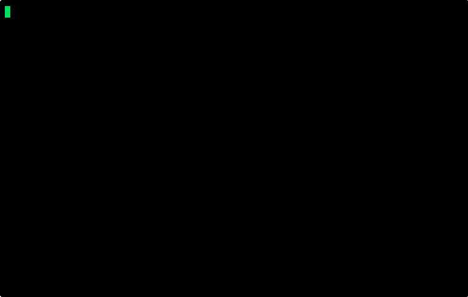

<p align="center">
  
</p>

<p align="center">
  <a href="./README.ja.md">日本語</a> | English
</p>

[](https://github.com/3062-in-zamud/dotcloak/actions/workflows/ci.yml)
[](https://www.npmjs.com/package/dotcloak)
[](https://opensource.org/licenses/MIT)

# dotcloak

> Encrypt your `.env` so AI coding tools can only read ciphertext.

dotcloak is a Node.js CLI that encrypts `.env` files with [age](https://age-encryption.org/) and only injects plaintext secrets into the child process you launch with `dotcloak run`.

- Repository: <https://github.com/3062-in-zamud/dotcloak>
- Node.js: `>=20`
- License: MIT

## Quick Start



```bash
npm install -g dotcloak

cat > .env <<'EOF'
API_KEY=super-secret
DATABASE_URL=postgres://localhost/app
EOF

dotcloak init
dotcloak status
dotcloak run -- node -e "console.log(process.env.API_KEY)"
```

What happens:

1. `dotcloak init` creates `.env.cloak`, `.dotcloak/key.age`, and `.dotcloak/config.toml`.
2. dotcloak appends `.dotcloak/key.age` to `.gitignore`, `.claudeignore`, and `.cursorignore`.
3. The original `.env` is deleted unless you pass `--keep`.
4. `dotcloak run` decrypts secrets in memory and passes them to the command you run.

For one-off usage without global install:

```bash
npx dotcloak init
npx dotcloak run -- npm start
```

## Static CLI Flow

```text
.env
  -> dotcloak init
  -> .env.cloak + .dotcloak/key.age
  -> dotcloak run -- <command>
  -> child process receives process.env
```

## Command Reference

### `dotcloak init`

Encrypt a plaintext `.env` file and initialize dotcloak in the current project.

```bash
dotcloak init
dotcloak init --keep
dotcloak init --file .env.local
```

### `dotcloak run -- <command>`

Run a command with decrypted secrets injected into the child process environment.

```bash
dotcloak run -- npm start
dotcloak run -- node -e "console.log(process.env.API_KEY)"
dotcloak run --file .env.production.cloak -- npm run worker
```

### `dotcloak set`

Add or update a secret in the encrypted store.

```bash
dotcloak set API_KEY=rotated-secret
dotcloak set DATABASE_URL
```

The second form prompts for a hidden value.

### `dotcloak unset`

Remove a secret from the encrypted store.

```bash
dotcloak unset API_KEY
```

### `dotcloak list`

List secrets from the encrypted store.

```bash
dotcloak list
dotcloak list --show
```

Values are masked by default. `--show` prints plaintext values and should only be used in a trusted terminal.

### `dotcloak edit`

Edit decrypted secrets in your `$EDITOR` or `$VISUAL`, then re-encrypt on save.

```bash
EDITOR=nvim dotcloak edit
VISUAL="code --wait" dotcloak edit
```

### `dotcloak status`

Show whether dotcloak is initialized and whether plaintext `.env` still exists.

```bash
dotcloak status
```

### `dotcloak key export`

Print the current age secret key so you can back it up or transfer it securely.

```bash
dotcloak key export > dotcloak-backup.age
```

### `dotcloak key import`

Import an exported age secret key into the current project.

```bash
dotcloak key import ./dotcloak-backup.age
```

## Security Model

### What dotcloak protects

- Plaintext `.env` does not need to stay on disk after `dotcloak init`.
- AI coding tools scanning the filesystem only see encrypted `.env.cloak`.
- Your app keeps using `process.env` with no application code changes.

### What dotcloak does not protect

- It does not protect secrets from a process you launch yourself with `dotcloak run`.
- It does not replace OS isolation, secret rotation, or host hardening.
- It does not protect against anyone who can already inspect your process memory or environment.

### Linux note

`dotcloak run` injects secrets into the child process environment. That protects `.env` from filesystem-based AI scans, but it does **not** harden Linux against same-user inspection of `/proc/<pid>/environ` or other OS-level process introspection. Treat dotcloak as filesystem protection, not a sandbox boundary.

## Why use this for AI tools?

Ignore files are advisory. dotcloak changes the artifact on disk instead: the file an AI tool can read is ciphertext, not plaintext. That is the narrow problem this tool is designed to solve.

## Development

- Contribution guide: [CONTRIBUTING.md](./CONTRIBUTING.md)
- Release checklist: [RELEASING.md](./RELEASING.md)

## License

[MIT](./LICENSE)
